# TrustRuntime 架构设计

| 文档版本 | V1.0 |
| 编写日期 | 2026-06-29 |

---

## 1. 系统架构概览

### 1.1 整体架构图

```mermaid
graph TB
    subgraph "机密计算虚机 (Confidential VM)"
        subgraph "TrustRuntime Service"
            MAIN[main.rs<br/>进程入口]

            subgraph "Framework Layer"
                CORE[core<br/>进程管理]
                CONFIG[config<br/>配置解析]
                LOG[logger<br/>日志系统]
                PM[plugin_manager<br/>插件管理]
                TR[transport<br/>传输层抽象]
                COMM[communication<br/>通信层]
                MSG[message<br/>报文处理]
                CERT[cert<br/>证书工具]
            end

            subgraph "Trustring Plugin"
                HANDLER[handler<br/>业务路由]
                SIGN[sign<br/>CMS签名]
                VERIFY[verify<br/>CMS验签]
                CERTLD[cert_loader<br/>证书加载]
                ERRMAP[error_code_mapper<br/>错误码映射]
            end
        end

        subgraph "系统依赖"
            OPENSSL[OpenSSL<br/>TLS/CMS]
            SYSTEMD[systemd<br/>服务管理]
            VSOCK[vsock<br/>虚拟机通信]
        end

        subgraph "文件系统"
            CERTS[/etc/cert/cms/<br/>证书目录]
            CFG[/etc/trustruntime/<br/>配置目录]
            LOGDIR[/var/log/trustruntime/<br/>日志目录]
        end
    end

    subgraph "外部客户端"
        CLIENT[Client Application<br/>业务应用]
    end

    MAIN --> CORE
    MAIN --> CONFIG
    MAIN --> LOG
    MAIN --> PM
    MAIN --> COMM

    PM --> HANDLER
    HANDLER --> SIGN
    HANDLER --> VERIFY
    HANDLER --> CERTLD

    SIGN --> OPENSSL
    VERIFY --> OPENSSL
    CERTLD --> CERT
    CERTLD --> CERTS

    COMM --> VSOCK
    COMM --> OPENSSL
    COMM --> MSG

    CORE --> SYSTEMD
    LOG --> LOGDIR
    CONFIG --> CFG

    CLIENT -->|TLS over vsock| COMM
```

### 1.2 部署架构图

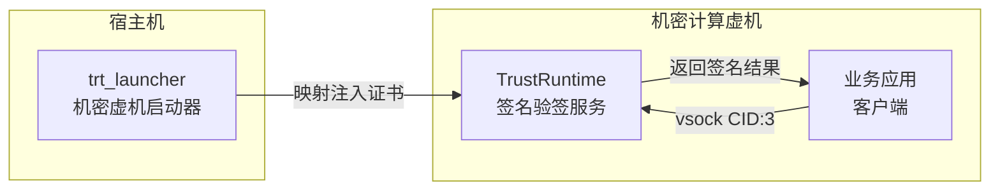

---

## 2. 模块说明

### 2.1 Framework 层（通用进程框架）

| 模块 | 职责 | 关键 trait/结构体 |
|------|------|------------------|
| `core` | 进程生命周期管理、信号处理、证书巡检 | `Daemon`, `SignalHandler`, `CertificateChecker` |
| `config` | TOML 配置解析 | `AppConfig` |
| `logger` | 日志初始化与管理 | `init_logger()` |
| `plugin_manager` | 插件生命周期管理 | `Plugin`, `PluginContext`, `PluginManager` |
| `transport` | 传输层抽象接口 | `TransportLayer`, `DataHandler`, `TransportError` |
| `communication` | vsock 通信 + TLS | `VsockTransport`（实现 TransportLayer） |
| `message` | 报文解析/构造 | `VsockHeader`, `VsockMessage` |
| `cert` | 证书加载工具 | PEM/DER 双格式支持 |

### 2.2 Trustring 插件（业务实现）

| 模块 | 职责 | 关键功能 |
|------|------|----------|
| `handler` | 业务路由 | 注册 0x10/0x12/0x14 handler |
| `sign` | CMS 签名 | ECC-256 签名实现 |
| `verify` | CMS 验签 | 验签 + 证书链校验 + CRL 校验 |
| `cert_loader` | 证书管理 | 加载签名/验签证书 |
| `error_code_mapper` | 错误映射 | OpenSSL ErrorStack → result code |

### 2.3 模块依赖关系

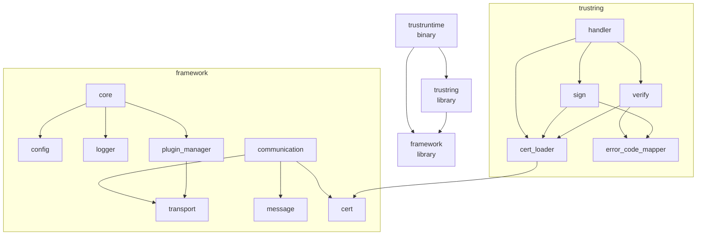

---

## 3. 数据流图

### 3.1 签名流程（0x10 → 0x11）

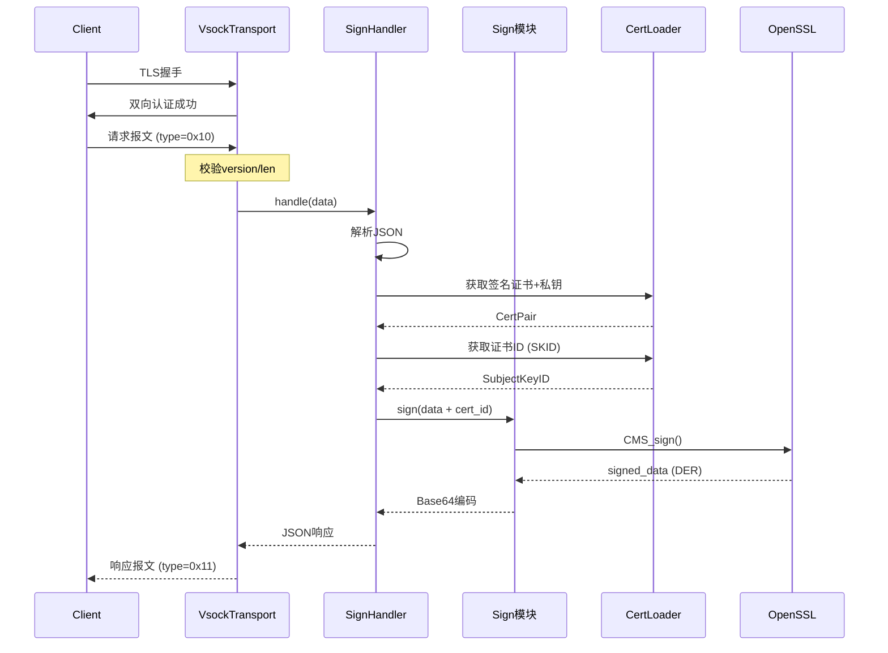

### 3.2 验签+签名流程（0x12 → 0x13）

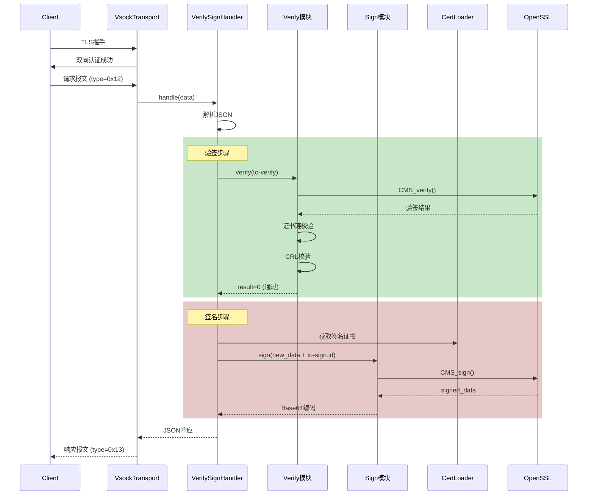

### 3.3 验签流程（0x14 → 0x15）

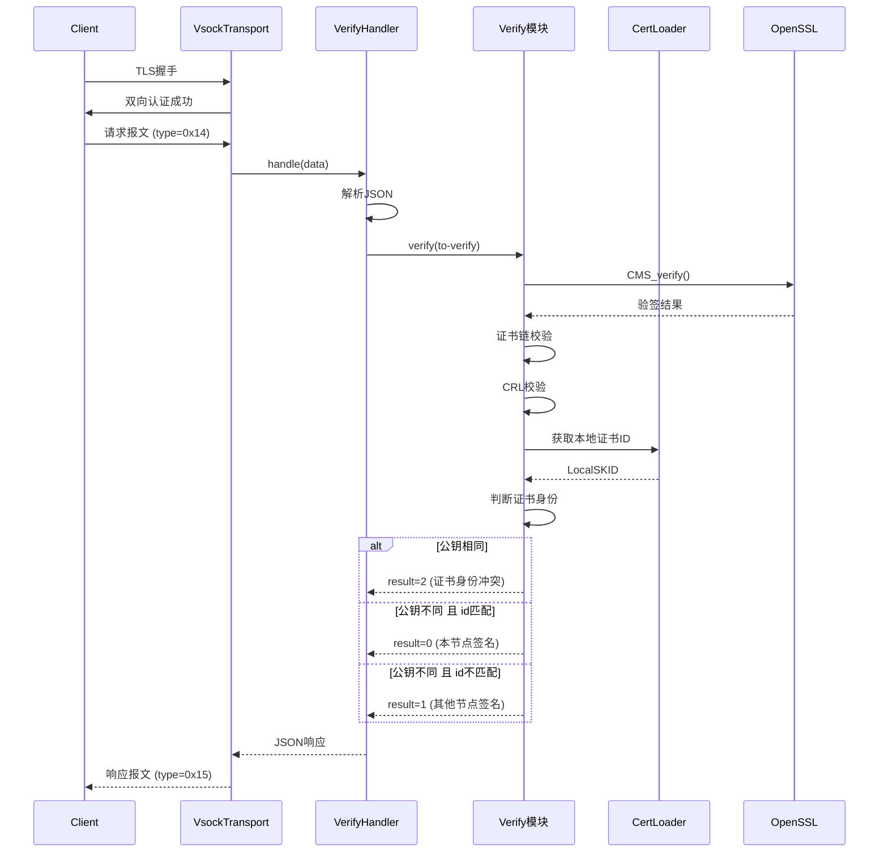

---

## 4. 时序图

### 4.1 服务启动时序

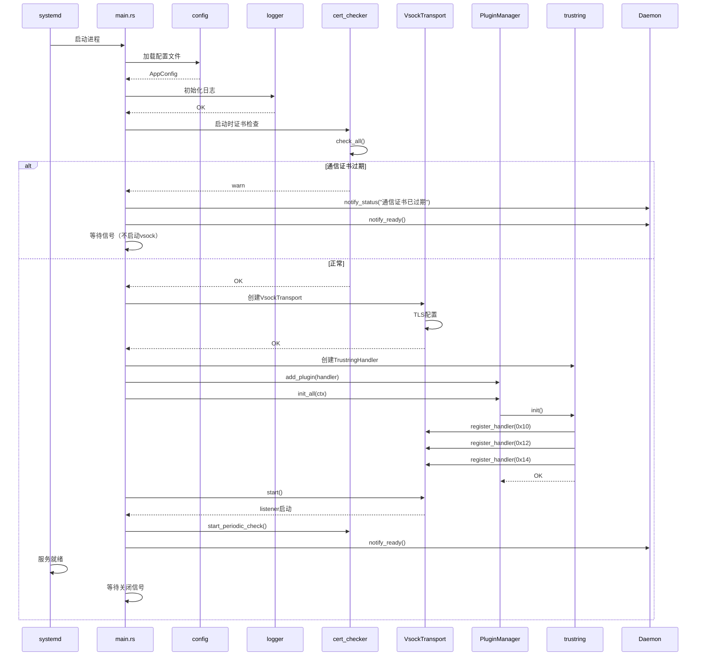

### 4.2 服务关闭时序

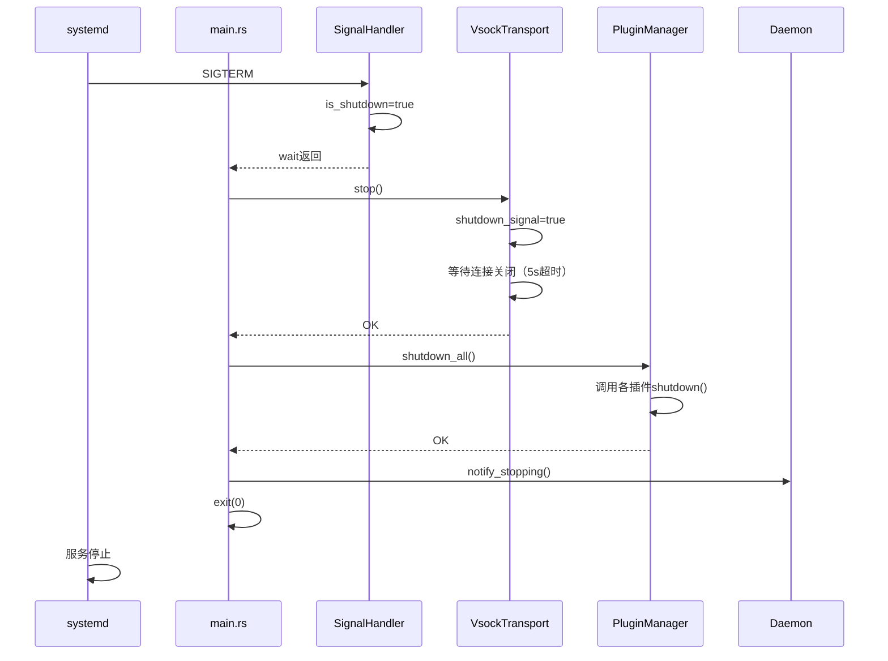

### 4.3 TLS 握手时序

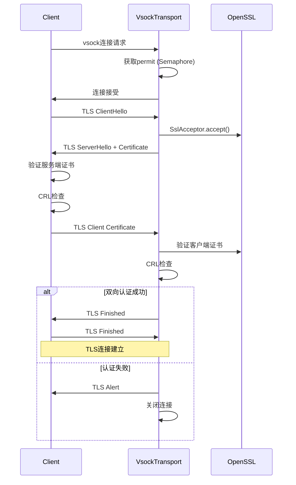

---

## 5. 接口协议

### 5.1 vsock 报文结构

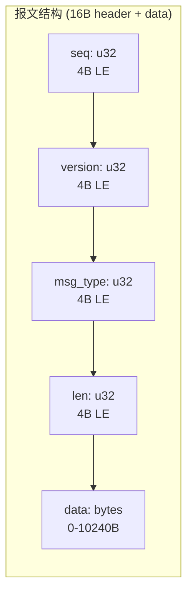

### 5.2 消息类型编码

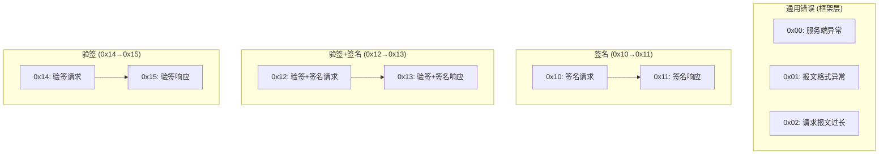

---

## 6. 错误处理流程

### 6.1 通用错误处理

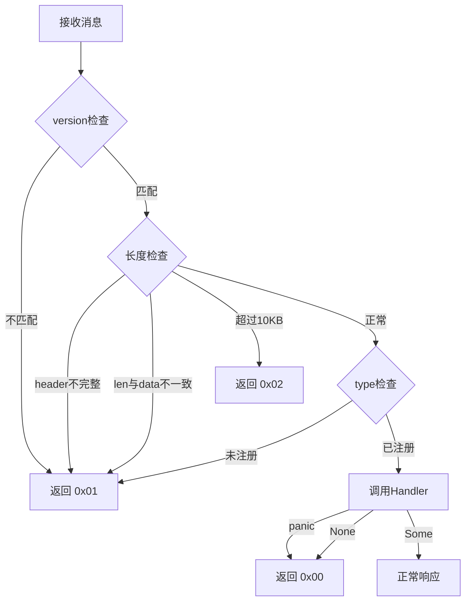

### 6.2 业务错误处理

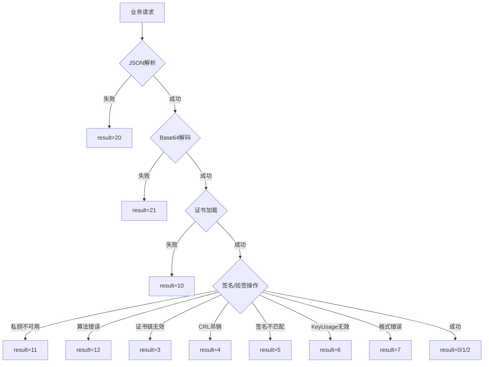

---

## 7. 配置结构

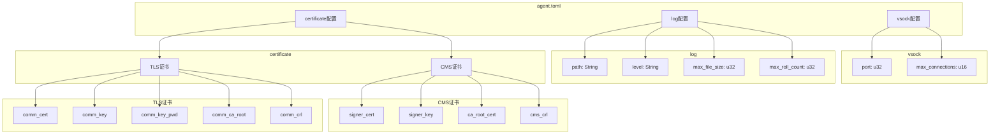

---

## 8. 相关文档

- [详细设计文档](detailed-design/)
- [架构决策记录](adr/)
- [接口文档](interface.md)
- [术语表](../CONTEXT.md)